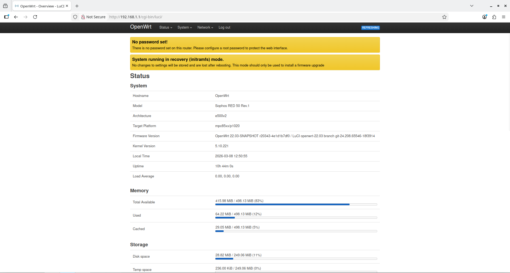

# OpenWrt 22.03 for Sophos RED 50

This repository provides a **prebuilt OpenWrt 22.03 firmware image** for the **Sophos RED 50** (PowerPC P1020). This port enables the device to function as a standard router, firewall, or VPN gateway.

---

## Hardware Specifications
* **CPU:** Freescale QorIQ P1020 (Dual Core @ 800MHz)
* **Architecture:** PowerPC (e500v2)
* **Reference:** [WikiDevi - Sophos RED 50](https://wikidevi.wi-cat.ru/index.php?title=Sophos_RED_50&oldid=388292)

---

## Current Status

| Component | Status | Notes |
| :--- | :--- | :--- |
| **USB** | ✅ Works | USB 2.0 ports active. |
| **WAN 2** | ✅ Works | Operates on a separate MDIO bus (eth1) linked to the CPU. |
| **WAN 1** | ⚠️ Partial | Managed via VLAN on the switch; in my testing it did work. |
| **LEDs** | ✅ Works | System and activity LEDs are operational. |
| **LAN Ports** | ⚠️ Partial| Works as an **unmanaged switch** (no software VLAN control). |
| **LCD Display** | ❌ Broken | Missing driver/service. *The LCD Deamon from the OEM Firmware did work on the prebuilt firmware.|
| **PCI Lanes** | ❌ Broken | Allocation issues with the PCIe bus. |

---

## Limitations


The internal DSA switch in the DTS is currently not properly ported into the DTS of the RED50. While it passes traffic, for now it only acts as a "dumb" switch. So features like **802.1Q VLAN tagging** or **802.3ad** cannot be modified from the software side yet.


### OEM Firmware Diagnostics (via `mvtool`)
For those interested, here is the output from the original firmware:
```bash
root@RED50:~# mvtool dumpports
                               0    1    2    3    4    5    6
                             WAN1 LAN4 LAN3 LAN2 LAN1 eth0 eth2
0x00 (PORT_STATUS):          1004 1E04 1004 1004 1004 0E09 0E09
0x01 (PCS_CONTROL):          0003 0003 0003 0003 0003 C03E C03E
0x02 (PAUSE_CONTROL):        FF00 FF00 FF00 FF00 FF00 FF00 FF00
0x03 (SWITCH_ID):            1712 1712 1712 1712 1712 1712 1712
0x06 (PORT_VLAN_MAP):        007E 007D 007B 0077 006F 005F 003F
0x07 (PVID):                 0003 0002 0002 0002 0002 0002 0003

root@RED50:~# mvtool dumpvtu
VID    2: P0:Discard    P1:Untagged   P2:Untagged   P3:Untagged   P4:Untagged   P5:Untagged   P6:Discard
VID    3: P0:Untagged   P1:Discard    P2:Discard    P3:Discard    P4:Discard    P5:Discard    P6:Untagged

root@RED50:~# for port in 0 1 2 3 4 5 6; do
> echo "=== Port $port ==="
> mvtool $port 0x0   # Read port status register
> mvtool $port 0x1   # Read port control register
> done
=== Port 0 ===
00/00: FFFF
00/01: FFFF
=== Port 1 ===
01/00: FFFF
01/01: FFFF
...
=== Port 6 ===
06/00: FFFF
06/01: FFFF
```
### DMESG Log (prebuilt firmware)
```bash
U-Boot 2010.12 (Jun 13 2012 - 18:57:31)

CPU0:  P1020E, Version: 1.1, (0x80ec0011)
Core:  E500, Version: 5.1, (0x80212051)
Clock Configuration:
       CPU0:533.333 MHz, CPU1:533.333 MHz,
       CCB:266.667 MHz,
       DDR:333.333 MHz (666.667 MT/s data rate) (Asynchronous), LBC:16.667 MHz
L1:    D-cache 32 kB enabled
       I-cache 32 kB enabled
Board: P1020RDB Rev
MB-351Z Ver.T03 2012-06-13
I2C:   ready
DRAM:  Configuring DDR for 666.667 MT/s data rate
DDR: 512 MiB (DDR3, 32-bit, CL=6, ECC off)
FLASH: 2 MiB
L2:    256 KB enabled
NAND:  256 MiB
EEPROM: NXID v0
eTSEC2 is in sgmii mode.

PCIE2: connected to Slot 1 as Root Complex (base addr ffe09000)
PCIE2: Bus 00 - 00

PCIE1: connected to Slot 2 as Root Complex (base addr ffe0a000)
PCIE1: Bus 01 - 01

In:    serial
Out:   serial
Err:   serial
Net:   eTSEC1: No support for PHY id ffffffff; assuming generic
eTSEC3: No support for PHY id ffffffff; assuming generic
Init switch to forwarding mode... Done
eTSEC1, eTSEC2, eTSEC3
Hit any key to stop autoboot:  0
MB351Z => setenv bootargs 'console=ttyS0,115200'
MB351Z => tftpboot 0x1000000 openwrt.bin
Speed: 1000, full duplex
Using eTSEC1 device
TFTP from server 10.0.0.151; our IP address is 10.0.0.200
Filename 'openwrt.bin'.
Load address: 0x1000000
Loading: T T T T T #################################################################
         #################################################################
         #################################################################
         #################################################################
         #################################################################
         #################################################################
         #################################################################
         #################################################################
         #################################################################
         #################################################################
         #################################################################
         #################################################################
         #################################################################
         #################################################################
         #############################################################
done
Bytes transferred = 14249028 (d96c44 hex)
MB351Z => bootm 0x1000000
## Booting kernel from FIT Image at 01000000 ...
   Using 'config-1' configuration
   Trying 'kernel-1' kernel subimage
     Description:  POWERPC OpenWrt Linux-5.10.221
     Type:         Kernel Image
     Compression:  uncompressed
     Data Start:   0x010000ec
     Data Size:    14234316 Bytes = 13.6 MiB
     Architecture: PowerPC
     OS:           Linux
     Load Address: 0x00000000
     Entry Point:  0x00000000
     Hash algo:    crc32
     Hash value:   da8cfc43
     Hash algo:    sha1
     Hash value:   9ed2d49071b43ab87ce0e5867b3ba062491e0bd2
   Verifying Hash Integrity ... crc32+ sha1+ OK
## Flattened Device Tree from FIT Image at 01000000
   Using 'config-1' configuration
   Trying 'fdt-1' FDT blob subimage
     Description:  POWERPC OpenWrt sophos_red-50-rev1 device tree blob
     Type:         Flat Device Tree
     Compression:  uncompressed
     Data Start:   0x01d934fc
     Data Size:    12797 Bytes = 12.5 KiB
     Architecture: PowerPC
     Hash algo:    crc32
     Hash value:   bb019374
     Hash algo:    sha1
     Hash value:   f6a59f1afe1b7e79180c54189fad2a3fa01f76cd
   Verifying Hash Integrity ... crc32+ sha1+ OK
   Booting using the fdt blob at 0x1d934fc
   Loading Kernel Image ... OK
OK
   Loading Device Tree to 00ff9000, end 00fff1fc ... OK
ft_fixup_l2cache: FDT_ERR_NOTFOUND
[    0.000000] Memory CAM mapping: 256/256 Mb, residual: 0Mb
[    0.000000] Linux version 5.10.221 (builder@buildhost) (powerpc-openwrt-linux-musl-gcc (Op1 2024
[    0.000000] Using P1020 RDB machine description
[    0.000000] ioremap() called early from 0xc07ebaf8. Use early_ioremap() instead
[    0.000000] printk: bootconsole [udbg0] enabled
[    0.000000] CPU maps initialized for 1 thread per core
[    0.000000] -----------------------------------------------------
[    0.000000] phys_mem_size     = 0x20000000
[    0.000000] dcache_bsize      = 0x20
[    0.000000] icache_bsize      = 0x20
[    0.000000] cpu_features      = 0x0000000010010128
[    0.000000]   possible        = 0x0000000010010128
[    0.000000]   always          = 0x0000000010010128
[    0.000000] cpu_user_features = 0x84e08000 0x08000000
[    0.000000] mmu_features      = 0x00020010
[    0.000000] -----------------------------------------------------
red_50_rev1_setup_arch()
[    0.000000] ioremap() called early from 0xc07ee2c0. Use early_ioremap() instead
[    0.000000] RED 50 Rev.1 board from Sophos
[    0.000000] barrier-nospec: using isync; sync as speculation barrier
[    0.000000] Zone ranges:
[    0.000000]   Normal   [mem 0x0000000000000000-0x000000001fffffff]
[    0.000000] Movable zone start for each node
[    0.000000] Early memory node ranges
[    0.000000]   node   0: [mem 0x0000000000000000-0x000000001fffffff]
[    0.000000] Initmem setup node 0 [mem 0x0000000000000000-0x000000001fffffff]
[    0.000000] MMU: Allocated 1088 bytes of context maps for 255 contexts
[    0.000000] percpu: Embedded 12 pages/cpu s19052 r8192 d21908 u49152
[    0.000000] Built 1 zonelists, mobility grouping on.  Total pages: 129920
[    0.000000] Kernel command line: console=ttyS0,115200
[    0.000000] Dentry cache hash table entries: 65536 (order: 6, 262144 bytes, linear)
[    0.000000] Inode-cache hash table entries: 32768 (order: 5, 131072 bytes, linear)
[    0.000000] mem auto-init: stack:off, heap alloc:off, heap free:off
[    0.000000] Memory: 504928K/524288K available (7232K kernel code, 664K rwdata, 856K rodata
[    0.000000] Kernel virtual memory layout:
[    0.000000]   * 0xffbdf000..0xfffff000  : fixmap
[    0.000000]   * 0xffbdc000..0xffbdf000  : early ioremap
[    0.000000]   * 0xe1000000..0xffbdc000  : vmalloc & ioremap
[    0.000000] SLUB: HWalign=32, Order=0-3, MinObjects=0, CPUs=2, Nodes=1
[    0.000000] rcu: Hierarchical RCU implementation.
[    0.000000]  Tracing variant of Tasks RCU enabled.
[    0.000000] rcu: RCU calculated value of scheduler-enlistment delay is 10 jiffies.
[    0.000000] NR_IRQS: 512, nr_irqs: 512, preallocated irqs: 16
[    0.000000] mpic: Setting up MPIC " OpenPIC  " version 1.2 at ffe40000, max 2 CPUs
[    0.000000] mpic: ISU size: 256, shift: 8, mask: ff
[    0.000000] mpic: Initializing for 256 sources
[    0.000017] clocksource: timebase: mask: 0xffffffffffffffff max_cycles: 0x7b00c4bad, max_i
[    0.010212] clocksource: timebase mult[1e000005] shift[24] registered
[    0.016789] pid_max: default: 32768 minimum: 301
[    0.021486] Mount-cache hash table entries: 1024 (order: 0, 4096 bytes, linear)
[    0.028760] Mountpoint-cache hash table entries: 1024 (order: 0, 4096 bytes, linear)
[    0.037746] mpic: requesting IPIs...
[    0.042523] rcu: Hierarchical SRCU implementation.
[    0.047536] dyndbg: Ignore empty _ddebug table in a CONFIG_DYNAMIC_DEBUG_CORE build
[    0.055437] smp: Bringing up secondary CPUs ...
[    0.061065] smp: Brought up 1 node, 2 CPUs
[    0.069177] clocksource: jiffies: mask: 0xffffffff max_cycles: 0xffffffff, max_idle_ns: 19
[    0.078994] futex hash table entries: 512 (order: 2, 16384 bytes, linear)
[    0.087671] NET: Registered protocol family 16

[    0.093374] thermal_sys: Registered thermal governor 'step_wise'
[    0.124331] PCI: Probing PCI hardware
[    0.134140] /soc@ffe00000/timer@41100: cannot get timer frequency.
[    0.140405] /soc@ffe00000/timer@42100: cannot get timer frequency.
[    0.169678] EDAC MC: Ver: 3.0.0
[    0.175713] clocksource: Switched to clocksource timebase
[    0.182276] NET: Registered protocol family 2
[    0.186962] IP idents hash table entries: 8192 (order: 4, 65536 bytes, linear)
[    0.195407] tcp_listen_portaddr_hash hash table entries: 512 (order: 0, 6144 bytes, linear
[    0.203822] TCP established hash table entries: 4096 (order: 2, 16384 bytes, linear)
[    0.211593] TCP bind hash table entries: 4096 (order: 3, 32768 bytes, linear)
[    0.218763] TCP: Hash tables configured (established 4096 bind 4096)
[    0.225184] UDP hash table entries: 256 (order: 1, 8192 bytes, linear)
[    0.231707] UDP-Lite hash table entries: 256 (order: 1, 8192 bytes, linear)
[    0.238908] NET: Registered protocol family 1
[    0.243222] PCI: CLS 0 bytes, default 32
[   10.691747] workingset: timestamp_bits=14 max_order=17 bucket_order=3
[   10.703718] squashfs: version 4.0 (2009/01/31) Phillip Lougher
[   10.709562] jffs2: version 2.2 (NAND) (SUMMARY) (LZMA) (RTIME) (CMODE_PRIORITY) (c) 2001-2
[   10.720529] Block layer SCSI generic (bsg) driver version 0.4 loaded (major 251)
[   10.758259] Serial: 8250/16550 driver, 16 ports, IRQ sharing enabled
▒[   10.771510] serial8250.0: ttyS0 at MMIO 0xffe04500 (irq = 42, base_baud = 16666666) is a
[   10.780256] printk: console [ttyS0] enabled
[   10.780256] printk: console [ttyS0] enabled
[   10.788610] printk: bootconsole [udbg0] disabled
[   10.788610] printk: bootconsole [udbg0] disabled
[   10.798607] serial8250.0: ttyS1 at MMIO 0xffe04600 (irq = 42, base_baud = 16666666) is a 1
[   10.808554] printk: console [ttyS0] disabled
[   10.813039] printk: console [ttyS0] enabled
[   10.818480] ffe04600.serial: ttyS1 at MMIO 0xffe04600 (irq = 42, base_baud = 16666666) is
[   10.844837] physmap-flash efe00000.nor: physmap platform flash device: [mem 0xefe00000-0xe
[   10.854358] efe00000.nor: Found 1 x16 devices at 0x0 in 16-bit bank. Manufacturer ID 0x000
[   10.864430] Amd/Fujitsu Extended Query Table at 0x0040
[   10.869670]   Amd/Fujitsu Extended Query version 1.3.
[   10.874736] number of CFI chips: 1
[   10.921614] 5 fixed-partitions partitions found on MTD device efe00000.nor
[   10.928566] Creating 5 MTD partitions on "efe00000.nor":
[   10.933897] 0x000000000000-0x0000000e0000 : "NOR reserved"
[   10.941030] 0x0000000e0000-0x0000000f0000 : "NOR env flash2"
[   10.948212] 0x0000000f0000-0x000000100000 : "NOR env flash"
[   10.954474] 0x000000100000-0x000000180000 : "NOR Normal mode"
[   10.961079] 0x000000180000-0x000000200000 : "NOR  Backup mode"
[   10.974310] nand: device found, Manufacturer ID: 0x2c, Chip ID: 0xda
[   10.980751] nand: Micron MT29F2G08ABAEAWP
[   10.984773] nand: 256 MiB, SLC, erase size: 128 KiB, page size: 2048, OOB size: 64
[   10.993237] Bad block table found at page 131008, version 0x01
[   11.000686] Bad block table found at page 130944, version 0x01
[   11.047609] 6 fixed-partitions partitions found on MTD device ffa00000.flash
[   11.054688] Creating 6 MTD partitions on "ffa00000.flash":
[   11.060255] 0x000000000000-0x000000200000 : "fdt1"
[   11.065931] 0x000000200000-0x000001a00000 : "uimage1"
[   11.072114] 0x000001a00000-0x000005a00000 : "rootfs1"
[   11.078323] 0x000005a00000-0x000005c00000 : "fdt2"
[   11.083878] 0x000005c00000-0x000007400000 : "kernel"
[   11.089867] 0x000007400000-0x00000c800000 : "ubi"
[   11.098740] eLBC NAND device at 0xffa00000, bank 1
[   11.176705] fsl-gianfar soc@ffe00000:ethernet@b0000: enabled errata workarounds, flags: 0x
[   11.196247] fsl-gianfar soc@ffe00000:ethernet@b0000 eth0: mac: 00:1a:8c:34:57:36
[   11.203680] fsl-gianfar soc@ffe00000:ethernet@b0000 eth0: Running with NAPI enabled
[   11.211383] fsl-gianfar soc@ffe00000:ethernet@b0000 eth0: RX BD ring size for Q[0]: 256
[   11.219420] fsl-gianfar soc@ffe00000:ethernet@b0000 eth0: RX BD ring size for Q[1]: 256
[   11.227457] fsl-gianfar soc@ffe00000:ethernet@b0000 eth0: TX BD ring size for Q[0]: 256
[   11.235479] fsl-gianfar soc@ffe00000:ethernet@b0000 eth0: TX BD ring size for Q[1]: 256
[   11.244261] fsl-gianfar soc@ffe00000:ethernet@b1000: enabled errata workarounds, flags: 0x
[   11.263447] fsl-gianfar soc@ffe00000:ethernet@b1000 eth1: mac: 00:1a:8c:34:57:37
[   11.270909] fsl-gianfar soc@ffe00000:ethernet@b1000 eth1: Running with NAPI enabled
[   11.278600] fsl-gianfar soc@ffe00000:ethernet@b1000 eth1: RX BD ring size for Q[0]: 256
[   11.286636] fsl-gianfar soc@ffe00000:ethernet@b1000 eth1: RX BD ring size for Q[1]: 256
[   11.294659] fsl-gianfar soc@ffe00000:ethernet@b1000 eth1: TX BD ring size for Q[0]: 256
[   11.302694] fsl-gianfar soc@ffe00000:ethernet@b1000 eth1: TX BD ring size for Q[1]: 256
[   11.331941] fsl-gianfar soc@ffe00000:ethernet@b2000: enabled errata workarounds, flags: 0x
[   11.351142] fsl-gianfar soc@ffe00000:ethernet@b2000 eth2: mac: 00:1a:8c:34:57:38
[   11.358600] fsl-gianfar soc@ffe00000:ethernet@b2000 eth2: Running with NAPI enabled
[   11.366288] fsl-gianfar soc@ffe00000:ethernet@b2000 eth2: RX BD ring size for Q[0]: 256
[   11.374312] fsl-gianfar soc@ffe00000:ethernet@b2000 eth2: RX BD ring size for Q[1]: 256
[   11.382344] fsl-gianfar soc@ffe00000:ethernet@b2000 eth2: TX BD ring size for Q[0]: 256
[   11.390378] fsl-gianfar soc@ffe00000:ethernet@b2000 eth2: TX BD ring size for Q[1]: 256
[   11.398617] ucc_geth_driver: QE UCC Gigabit Ethernet Controller
[   11.405007] i2c /dev entries driver
[   11.408949] mpc-i2c ffe03000.i2c: timeout 1000000 us
[   11.414681] mpc-i2c ffe03100.i2c: timeout 1000000 us
[   11.420404] booke_wdt: powerpc book-e watchdog driver loaded
[   11.426347] Freescale(R) MPC85xx EDAC driver, (C) 2006 Montavista Software
[   11.433542] fsl_mc_err_probe: No ECC DIMMs discovered
[   11.439704] EDAC DEVICE0: Giving out device to module MPC85xx_edac controller mpc85xx_l2_e
[   11.451048] MPC85xx_edac acquired irq 16 for L2 Err
[   11.455991] MPC85xx_edac L2 err registered
[   11.461829] NET: Registered protocol family 10
[   11.468061] Segment Routing with IPv6
[   11.471835] NET: Registered protocol family 17
[   11.476440] bridge: filtering via arp/ip/ip6tables is no longer available by default. Upda
[   11.489449] 8021q: 802.1Q VLAN Support v1.8
[   11.493706] drmem: No dynamic reconfiguration memory found
[   11.503679] UBI error: no valid UBI magic found inside mtd10
[   11.524045] Freeing unused kernel memory: 5152K
[   11.565740] Run /init as init process
[   12.348257] init: Console is alive
[   12.351972] init: - watchdog -
[   12.376793] kmodloader: loading kernel modules from /etc/modules-boot.d/*
[   12.400692] usbcore: registered new interface driver usbfs
[   12.406352] usbcore: registered new interface driver hub
[   12.411783] usbcore: registered new device driver usb
[   12.420963] Button Hotplug driver version 0.4.1
[   12.473562] ehci_hcd: USB 2.0 'Enhanced' Host Controller (EHCI) Driver
[   12.490102] SCSI subsystem initialized
[   12.498290] fsl-ehci: Freescale EHCI Host controller driver
[   12.505129] ehci-platform: EHCI generic platform driver
[   12.512212] fsl-ehci fsl-ehci.0: Freescale On-Chip EHCI Host Controller
[   12.518978] fsl-ehci fsl-ehci.0: new USB bus registered, assigned bus number 1
[   12.526367] fsl-ehci fsl-ehci.0: irq 28, io mem 0xffe22000
[   12.555792] fsl-ehci fsl-ehci.0: USB 2.0 started, EHCI 1.00
[   12.562405] hub 1-0:1.0: USB hub found
[   12.566329] hub 1-0:1.0: 1 port detected
[   12.579514] usbcore: registered new interface driver usb-storage
[   12.586108] kmodloader: done loading kernel modules from /etc/modules-boot.d/*
[   12.596140] init: - preinit -
[   12.745368] random: procd: uninitialized urandom read (4 bytes read)
[   12.746266] fsl-gianfar soc@ffe00000:ethernet@b0000 eth0: Link is Up - 1Gbps/Full - flow c
[   12.761202] IPv6: ADDRCONF(NETDEV_CHANGE): eth0: link becomes ready
Press the [f] key and hit [enter] to enter failsafe mode
Press the [1], [2], [3] or [4] key and hit [enter] to select the debug level
[   12.855754] usb 1-1: new high-speed USB device number 2 using fsl-ehci
[   13.058319] hub 1-1:1.0: USB hub found
[   13.062485] hub 1-1:1.0: 2 ports detected
[   16.899078] fsl-gianfar soc@ffe00000:ethernet@b0000 eth0: Link is Down
[   16.913826] procd: - early -
[   16.917019] procd: - watchdog -
[   17.842084] procd: - watchdog -
[   17.845639] procd: - ubus -
[   17.854870] random: ubusd: uninitialized urandom read (4 bytes read)
[   17.899154] random: ubusd: uninitialized urandom read (4 bytes read)
[   17.905980] random: ubusd: uninitialized urandom read (4 bytes read)
[   17.915497] procd: - init -
Please press Enter to activate this console.
[   18.329303] kmodloader: loading kernel modules from /etc/modules.d/*
[   18.345218] talitos ffe30000.crypto: hwrng
[   18.357377] talitos ffe30000.crypto: fsl,sec3.3 algorithms registered in /proc/crypto
[   18.698142] Bridge firewalling registered
[   18.703450] Loading modules backported from Linux version v5.15.162-0-gf45bea23c39cb
[   18.711438] Backport generated by backports.git v5.15.162-1-0-g9fa1c65c
[   18.757325] xt_time: kernel timezone is -0000
[   18.764036] usbcore: registered new interface driver cdc_ether
[   18.917009] PPP generic driver version 2.4.2
[   18.923439] NET: Registered protocol family 24
[   18.930511] usbcore: registered new interface driver rndis_host
[   18.980619] kmodloader: done loading kernel modules from /etc/modules.d/*
[   19.632037] urngd: v1.0.2 started.
[   20.105387] random: jshn: uninitialized urandom read (4 bytes read)
[   20.229837] random: jshn: uninitialized urandom read (4 bytes read)
[   20.319775] random: jshn: uninitialized urandom read (4 bytes read)
[   20.598683] random: crng init done
[   20.602125] random: 25 urandom warning(s) missed due to ratelimiting


BusyBox v1.35.0 (2024-07-22 22:56:41 UTC) built-in shell (ash)

  _______                     ________        __
 |       |.-----.-----.-----.|  |  |  |.----.|  |_
 |   -   ||  _  |  -__|     ||  |  |  ||   _||   _|
 |_______||   __|_____|__|__||________||__|  |____|
          |__| W I R E L E S S   F R E E D O M
 -----------------------------------------------------
 OpenWrt 22.03-SNAPSHOT, r20343-4e1d1b7df0
 -----------------------------------------------------
=== WARNING! =====================================
There is no root password defined on this device!
Use the "passwd" command to set up a new password
in order to prevent unauthorized SSH logins.
--------------------------------------------------
root@OpenWrt:/#

```
### DMESG OEM Firmware 
(Two of them did bootloop on me, I had to buy two more)  
```


U-Boot 2010.12 (Jun 13 2012 - 18:57:31)

CPU0:  P1020E, Version: 1.1, (0x80ec0011)
Core:  E500, Version: 5.1, (0x80212051)
Clock Configuration:
       CPU0:533.333 MHz, CPU1:533.333 MHz, 
       CCB:266.667 MHz,
       DDR:333.333 MHz (666.667 MT/s data rate) (Asynchronous), LBC:16.667 MHz
L1:    D-cache 32 kB enabled
       I-cache 32 kB enabled
Board: P1020RDB Rev
MB-351Z Ver.T03 2012-06-13
I2C:   ready
DRAM:  Configuring DDR for 666.667 MT/s data rate
DDR: 512 MiB (DDR3, 32-bit, CL=6, ECC off)
FLASH: 2 MiB
L2:    256 KB enabled
NAND:  256 MiB
EEPROM: NXID v0
eTSEC2 is in sgmii mode.

PCIE2: connected to Slot 1 as Root Complex (base addr ffe09000)
PCIE2: Bus 00 - 00

PCIE1: connected to Slot 2 as Root Complex (base addr ffe0a000)
PCIE1: Bus 01 - 01

In:    serial
Out:   serial
Err:   serial
Net:   eTSEC1: No support for PHY id ffffffff; assuming generic
eTSEC3: No support for PHY id ffffffff; assuming generic
Init switch to forwarding mode... Done
eTSEC1, eTSEC2, eTSEC3
Hit any key to stop autoboot:  5  4  3  2  1  0 

NAND read: device 0 offset 0x5100000, size 0x100000
Bad block table found at page 131008, version 0x01
Bad block table found at page 130944, version 0x01
 1048576 bytes read: OK

NAND read: device 0 offset 0x5200000, size 0x1000000
 16777216 bytes read: OK
## Booting kernel from Legacy Image at 01000000 ...
   Image Name:   Linux-2.6.38.8
   Created:      2012-10-16  14:04:51 UTC
   Image Type:   PowerPC Linux Kernel Image (gzip compressed)
   Data Size:    1717541 Bytes = 1.6 MiB
   Load Address: 00000000
   Entry Point:  00000000
   Verifying Checksum ... OK
## Flattened Device Tree blob at 00c00000
   Booting using the fdt blob at 0xc00000
   Uncompressing Kernel Image ... OK
   Loading Device Tree to 00ffa000, end 00fffb18 ... OK
[    0.000000] Using P1020 RDB machine description
[    0.000000] Memory CAM mapping: 256/256 Mb, residual: 0Mb
[    0.000000] Linux version 2.6.38.8 (hschaa@sles11) (gcc version 4.5.4 20110808 (prerelease) (Linaro GCC 4.5-2011.08) ) #1 SMP Tue Oct 16 16:04:47 CEST 2012
[    0.000000] CPU maps initialized for 1 thread per core
[    0.000000] bootconsole [udbg0] enabled
setup_arch: bootmem
mpc85xx_rdb_setup_arch()
[    0.000000] Found FSL PCI host bridge at 0x00000000ffe09000. Firmware bus number: 0->0
[    0.000000] PCI host bridge /pcie@ffe09000  ranges:
[    0.000000]  MEM 0x00000000a0000000..0x00000000bfffffff -> 0x00000000a0000000 
[    0.000000]   IO 0x00000000ffc30000..0x00000000ffc3ffff -> 0x0000000000000000
[    0.000000] /pcie@ffe09000: PCICSRBAR @ 0xfff00000
[    0.000000] Found FSL PCI host bridge at 0x00000000ffe0a000. Firmware bus number: 0->0
[    0.000000] PCI host bridge /pcie@ffe0a000  ranges:
[    0.000000]  MEM 0x00000000c0000000..0x00000000dfffffff -> 0x00000000c0000000 
[    0.000000]   IO 0x00000000ffc20000..0x00000000ffc2ffff -> 0x0000000000000000
[    0.000000] /pcie@ffe0a000: PCICSRBAR @ 0xfff00000
[    0.000000] MPC85xx RDB board from Freescale Semiconductor
arch: exit
[    0.000000] Zone PFN ranges:
[    0.000000]   DMA      0x00000000 -> 0x00020000
[    0.000000]   Normal   empty
[    0.000000] Movable zone start PFN for each node
[    0.000000] early_node_map[1] active PFN ranges
[    0.000000]     0: 0x00000000 -> 0x00020000
[    0.000000] MMU: Allocated 1088 bytes of context maps for 255 contexts
[    0.000000] PERCPU: Embedded 7 pages/cpu @c078f000 s6816 r8192 d13664 u32768
[    0.000000] Built 1 zonelists in Zone order, mobility grouping on.  Total pages: 130048
[    0.000000] Kernel command line: root=/dev/mtdblock10 console=ttyS0,115200 
[    0.000000] PID hash table entries: 2048 (order: 1, 8192 bytes)
[    0.000000] Dentry cache hash table entries: 65536 (order: 6, 262144 bytes)
[    0.000000] Inode-cache hash table entries: 32768 (order: 5, 131072 bytes)
[    0.000000] Memory: 515972k/524288k available (3332k kernel code, 8316k reserved, 196k data, 89k bss, 160k init)
[    0.000000] Kernel virtual memory layout:
[    0.000000]   * 0xfffdf000..0xfffff000  : fixmap
[    0.000000]   * 0xfdfda000..0xfe000000  : early ioremap
[    0.000000]   * 0xe1000000..0xfdfda000  : vmalloc & ioremap
[    0.000000] SLUB: Genslabs=15, HWalign=32, Order=0-3, MinObjects=0, CPUs=2, Nodes=1
[    0.000000] Hierarchical RCU implementation.
[    0.000000] 	RCU-based detection of stalled CPUs is disabled.
[    0.000000] NR_IRQS:512
[    0.000000] mpic: Setting up MPIC " OpenPIC  " version 1.2 at ffe40000, max 2 CPUs
[    0.000000] mpic: ISU size: 256, shift: 8, mask: ff
[    0.000000] mpic: Initializing for 256 sources
[    0.000000] clocksource: timebase mult[7800001] shift[22] registered
[    0.006348] pid_max: default: 32768 minimum: 301
[    0.011264] Mount-cache hash table entries: 512
[    0.018715] mpic: requesting IPIs...
[    0.127600] Brought up 2 CPUs
[    0.131849] NET: Registered protocol family 16
             
[    0.139555] PCI: Probing PCI hardware
[    0.143447] pci 0000:00:00.0: ignoring class b20 (doesn't match header type 01)
[    0.150840] pci 0000:00:00.0: PCI bridge to [bus 01-ff]
[    0.156751] pci 0001:02:00.0: ignoring class b20 (doesn't match header type 01)
[    0.164134] pci 0001:02:00.0: PCI bridge to [bus 03-ff]
[    0.169874] pci 0000:00:00.0: PCI bridge to [bus 01-01]
[    0.175040] pci 0000:00:00.0:   bridge window [io  0xfdfed000-0xfdffcfff]
[    0.181817] pci 0000:00:00.0:   bridge window [mem 0xa0000000-0xbfffffff]
[    0.188600] pci 0000:00:00.0:   bridge window [mem pref disabled]
[    0.194700] pci 0000:00:00.0: enabling device (0106 -> 0107)
[    0.200350] pci 0001:02:00.0: PCI bridge to [bus 03-03]
[    0.205567] pci 0001:02:00.0:   bridge window [io  0xfdfdb000-0xfdfeafff]
[    0.212353] pci 0001:02:00.0:   bridge window [mem 0xc0000000-0xdfffffff]
[    0.219138] pci 0001:02:00.0:   bridge window [mem pref disabled]
[    0.225232] pci 0001:02:00.0: enabling device (0106 -> 0107)
[    0.235695] bio: create slab <bio-0> at 0
[    0.240966] usbcore: registered new interface driver usbfs
[    0.246583] usbcore: registered new interface driver hub
[    0.252058] usbcore: registered new device driver usb
[    0.258075] Switching to clocksource timebase
[    0.265353] NET: Registered protocol family 2
[    0.269877] IP route cache hash table entries: 4096 (order: 2, 16384 bytes)
[    0.277050] TCP established hash table entries: 16384 (order: 5, 131072 bytes)
[    0.284642] TCP bind hash table entries: 16384 (order: 5, 131072 bytes)
[    0.291591] TCP: Hash tables configured (established 16384 bind 16384)
[    0.298052] TCP reno registered
[    0.301195] UDP hash table entries: 256 (order: 1, 8192 bytes)
[    0.307037] UDP-Lite hash table entries: 256 (order: 1, 8192 bytes)
[    0.313803] NET: Registered protocol family 1
[    0.342586] squashfs: version 4.0 (2009/01/31) Phillip Lougher
[    0.348480] JFFS2 version 2.2 (NAND) (SUMMARY) (LZMA) (RTIME) (CMODE_PRIORITY) (c) 2001-2006 Red Hat, Inc.
[    0.359403] msgmni has been set to 1007
[    0.363440] io scheduler noop registered
[    0.367308] io scheduler deadline registered (default)
[    0.571510] Serial: 8250/16550 driver, 2 ports, IRQ sharing enabled
[    0.635294] serial8250.0: ttyS0 at MMIO 0xffe04500 (irq = 42) is a 16550A
[    0.642056] console [ttyS0] enabled, bootconsole disabled
[    0.642056] console [ttyS0] enabled, bootconsole disabled
[    0.675237] serial8250.0: ttyS1 at MMIO 0xffe04600 (irq = 42) is a 16550A
[    0.711597] ffe04500.serial: ttyS0 at MMIO 0xffe04500 (irq = 42) is a 16550
[    0.747328] ffe04600.serial: ttyS1 at MMIO 0xffe04600 (irq = 42) is a 16550
[    0.778760] Generic RTC Driver v1.07
[    0.784446] efe00000.nor: Found 1 x16 devices at 0x0 in 16-bit bank. Manufacturer ID 0x000001 Chip ID 0x002249
[    0.794508] Amd/Fujitsu Extended Query Table at 0x0040
[    0.799727]   Amd/Fujitsu Extended Query version 1.3.
[    0.804801] number of CFI chips: 1
[    0.808447] cmdlinepart partition parsing not available
[    0.813890] RedBoot partition parsing not available
[    0.818821] Creating 5 MTD partitions on "efe00000.nor":
[    0.824161] 0x000000000000-0x0000000e0000 : "NOR reserved"
[    0.831263] 0x0000000e0000-0x0000000f0000 : "NOR env flash2"
[    0.838494] 0x0000000f0000-0x000000100000 : "NOR env flash"
[    0.845642] 0x000000100000-0x000000180000 : "NOR Normal mode"
[    0.852960] 0x000000180000-0x000000200000 : "NOR  Backup mode"
[    0.860832] fsl-lbc ffe05000.localbus: read_byte beyond end of buffer
[    0.867366] fsl-lbc ffe05000.localbus: read_byte beyond end of buffer
[    0.873829] fsl-lbc ffe05000.localbus: read_byte beyond end of buffer
[    0.880296] NAND device: Manufacturer ID: 0x2c, Chip ID: 0xda (Micron NAND 256MiB 3,3V 8-bit)
[    0.892351] cmdlinepart partition parsing not available
[    0.897797] RedBoot partition parsing not available
[    0.902731] Creating 7 MTD partitions on "ffa00000.flash":
[    0.908242] 0x000000000000-0x000000100000 : "fdt1"
[    0.914753] 0x000000100000-0x000001100000 : "uimage1"
[    0.921412] 0x000001100000-0x000005100000 : "rootfs1"
[    0.928115] 0x000005100000-0x000005200000 : "fdt2"
[    0.934520] 0x000005200000-0x000006200000 : "uimage2"
[    0.941240] 0x000006200000-0x00000a200000 : "rootfs2"
[    0.947978] 0x00000a200000-0x000010000000 : "data"
[    0.954495] eLBC NAND device at 0xffa00000, bank 1
[    0.969350] Fixed MDIO Bus: probed
[    0.990639] eth0: Gianfar Ethernet Controller Version 1.2, 00:1a:8c:34:7e:e4
[    0.997722] eth0: Running with NAPI enabled
[    1.001958] eth0: RX BD ring size for Q[0]: 256
[    1.006505] eth0: RX BD ring size for Q[1]: 256
[    1.011049] eth0: RX BD ring size for Q[2]: 256
[    1.015600] eth0: RX BD ring size for Q[3]: 256
[    1.020144] eth0: RX BD ring size for Q[4]: 256
[    1.024688] eth0: RX BD ring size for Q[5]: 256
[    1.029231] eth0: RX BD ring size for Q[6]: 256
[    1.033777] eth0: RX BD ring size for Q[7]: 256
[    1.038322] eth0: TX BD ring size for Q[0]: 256
[    1.042866] eth0: TX BD ring size for Q[1]: 256
[    1.047412] eth0: TX BD ring size for Q[2]: 256
[    1.051956] eth0: TX BD ring size for Q[3]: 256
[    1.056500] eth0: TX BD ring size for Q[4]: 256
[    1.061044] eth0: TX BD ring size for Q[5]: 256
[    1.065590] eth0: TX BD ring size for Q[6]: 256
[    1.070134] eth0: TX BD ring size for Q[7]: 256
[    1.086612] eth1: Gianfar Ethernet Controller Version 1.2, 00:1a:8c:34:7e:e5
[    1.093694] eth1: Running with NAPI enabled
[    1.097892] eth1: RX BD ring size for Q[0]: 256
[    1.102439] eth1: RX BD ring size for Q[1]: 256
[    1.106983] eth1: RX BD ring size for Q[2]: 256
[    1.111533] eth1: RX BD ring size for Q[3]: 256
[    1.116077] eth1: RX BD ring size for Q[4]: 256
[    1.120621] eth1: RX BD ring size for Q[5]: 256
[    1.125165] eth1: RX BD ring size for Q[6]: 256
[    1.129712] eth1: RX BD ring size for Q[7]: 256
[    1.134256] eth1: TX BD ring size for Q[0]: 256
[    1.138801] eth1: TX BD ring size for Q[1]: 256
[    1.143348] eth1: TX BD ring size for Q[2]: 256
[    1.147892] eth1: TX BD ring size for Q[3]: 256
[    1.152436] eth1: TX BD ring size for Q[4]: 256
[    1.156980] eth1: TX BD ring size for Q[5]: 256
[    1.161527] eth1: TX BD ring size for Q[6]: 256
[    1.166071] eth1: TX BD ring size for Q[7]: 256
[    1.182608] eth2: Gianfar Ethernet Controller Version 1.2, 00:1a:8c:34:7e:e6
[    1.189689] eth2: Running with NAPI enabled
[    1.193888] eth2: RX BD ring size for Q[0]: 256
[    1.198435] eth2: RX BD ring size for Q[1]: 256
[    1.202979] eth2: RX BD ring size for Q[2]: 256
[    1.207529] eth2: RX BD ring size for Q[3]: 256
[    1.212073] eth2: RX BD ring size for Q[4]: 256
[    1.216617] eth2: RX BD ring size for Q[5]: 256
[    1.221161] eth2: RX BD ring size for Q[6]: 256
[    1.225708] eth2: RX BD ring size for Q[7]: 256
[    1.230252] eth2: TX BD ring size for Q[0]: 256
[    1.234797] eth2: TX BD ring size for Q[1]: 256
[    1.239343] eth2: TX BD ring size for Q[2]: 256
[    1.243887] eth2: TX BD ring size for Q[3]: 256
[    1.248432] eth2: TX BD ring size for Q[4]: 256
[    1.252976] eth2: TX BD ring size for Q[5]: 256
[    1.257522] eth2: TX BD ring size for Q[6]: 256
[    1.262066] eth2: TX BD ring size for Q[7]: 256
[    1.266832] ucc_geth: QE UCC Gigabit Ethernet Controller
[    1.273128] Freescale PowerQUICC MII Bus: probed
[    1.278075] mdio_bus mdio@ffe24000: error probing PHY at address 16
[    1.285401] Freescale PowerQUICC MII Bus: probed
[    1.291037] ehci_hcd: USB 2.0 'Enhanced' Host Controller (EHCI) Driver
[    1.298122] /soc@ffe00000/usb@22000: Invalid 'dr_mode' property, fallback to host mode
[    1.306392] fsl-ehci fsl-ehci.0: Freescale On-Chip EHCI Host Controller
[    1.313196] fsl-ehci fsl-ehci.0: new USB bus registered, assigned bus number 1
[    1.358458] fsl-ehci fsl-ehci.0: irq 28, io mem 0xffe22000
[    1.374421] fsl-ehci fsl-ehci.0: USB 2.0 started, EHCI 1.00
[    1.380982] hub 1-0:1.0: USB hub found
[    1.384775] hub 1-0:1.0: 1 port detected
[    1.389098] PowerPC Book-E Watchdog Timer Loaded
[    1.395562] of:talitos ffe30000.crypto: hwrng
[    1.400091] of:talitos ffe30000.crypto: authenc-hmac-sha1-cbc-aes-talitos
[    1.407050] of:talitos ffe30000.crypto: authenc-hmac-sha1-cbc-3des-talitos
[    1.414053] of:talitos ffe30000.crypto: authenc-hmac-sha256-cbc-aes-talitos
[    1.421155] of:talitos ffe30000.crypto: authenc-hmac-sha256-cbc-3des-talitos
[    1.428349] of:talitos ffe30000.crypto: authenc-hmac-md5-cbc-aes-talitos
[    1.435190] of:talitos ffe30000.crypto: authenc-hmac-md5-cbc-3des-talitos
[    1.442105] of:talitos ffe30000.crypto: cbc-aes-talitos
[    1.447464] of:talitos ffe30000.crypto: cbc-3des-talitos
[    1.452901] of:talitos ffe30000.crypto: md5-talitos
[    1.457915] of:talitos ffe30000.crypto: sha1-talitos
[    1.463017] of:talitos ffe30000.crypto: sha224-talitos
[    1.468279] of:talitos ffe30000.crypto: sha256-talitos
[    1.473549] of:talitos ffe30000.crypto: sha384-talitos
[    1.478832] of:talitos ffe30000.crypto: sha512-talitos
[    1.484420] TCP westwood registered
[    1.487954] NET: Registered protocol family 17
[    1.492579] Bridge firewalling registered
[    1.496616] 802.1Q VLAN Support v1.8 Ben Greear <greearb@candelatech.com>
[    1.503432] All bugs added by David S. Miller <davem@redhat.com>
[    1.516069] VFS: Mounted root (squashfs filesystem) readonly on device 31:10.
[    1.523300] Freeing unused kernel memory: 160k init
[    1.722460] usb 1-1: new high speed USB device using fsl-ehci and address 2
[    1.861500] hub 1-1:1.0: USB hub found
[    1.865758] hub 1-1:1.0: 2 ports detected
- preinit -
Press the [f] key and hit [enter] to enter failsafe mode
[    4.894818] usb 1-1.1: new high speed USB device using fsl-ehci and address 3
- regular preinit -
searching for "data"
mounting ramdisk
searching for "NOR reserved"
trying to mount config
binding read-only configuration
checking if partition is valid
trying to mount config
[    7.445556] JFFS2 notice: (1672) jffs2_build_xattr_subsystem: complete building xattr subsystem, 0 of xdatum (0 unchecked, 0 orphan) and 0 of xref (0 dead, 0 orphan) found.
merging partitions
overlay of "astaro/cfg"
overlay of "astaro/wifi"
- init -

Please press Enter to activate this console. [    8.215228] 88E1111
[    8.616709] Compat-wireless backport release: compat-wireless-2011-08-25
[    8.623458] Backport based on wireless-testing.git master-2011-09-14
[    8.747974] cfg80211: Calling CRDA to update world regulatory domain
[    8.908876] SCSI subsystem initialized
[    8.981701] cfg80211: World regulatory domain updated:
[    8.986902] cfg80211:     (start_freq - end_freq @ bandwidth), (max_antenna_gain, max_eirp)
[    8.995284] cfg80211:     (2402000 KHz - 2472000 KHz @ 40000 KHz), (300 mBi, 2000 mBm)
[    9.003233] cfg80211:     (2457000 KHz - 2482000 KHz @ 20000 KHz), (300 mBi, 2000 mBm)
[    9.011191] cfg80211:     (2474000 KHz - 2494000 KHz @ 20000 KHz), (300 mBi, 2000 mBm)
[    9.019141] cfg80211:     (5170000 KHz - 5250000 KHz @ 40000 KHz), (300 mBi, 2000 mBm)
[    9.027091] cfg80211:     (5735000 KHz - 5835000 KHz @ 40000 KHz), (300 mBi, 2000 mBm)
[    9.233518] PHY: mdio@ffe24000:12 - Link is Up - 1000/Half
[    9.453994] PPP generic driver version 2.4.2
[    9.615460] ip_tables: (C) 2000-2006 Netfilter Core Team
[    9.754231] NET: Registered protocol family 24
[    9.919065] nf_conntrack version 0.5.0 (8064 buckets, 32256 max)
[   10.074494] PHY: 0:10 - Link is Up - 1000/Full
[   10.318592] xt_time: kernel timezone is -0000
[   10.386453] PHY: 0:02 - Link is Up - 1000/Full
[   10.519472] Ebtables v2.0 registered
[   10.759150] ohci_hcd: USB 1.1 'Open' Host Controller (OHCI) Driver
[   10.808310] uhci_hcd: USB Universal Host Controller Interface driver
[   10.904120] usbcore: registered new interface driver ath9k_htc
[   10.951480] usbcore: registered new interface driver usbserial
[   10.957436] USB Serial support registered for generic
[   10.962637] usbcore: registered new interface driver usbserial_generic
[   10.969201] usbserial: USB Serial Driver core
[   11.079563] USB Serial support registered for Keyspan - (without firmware)
[   11.086557] USB Serial support registered for Keyspan 1 port adapter
[   11.093034] USB Serial support registered for Keyspan 2 port adapter
[   11.099499] USB Serial support registered for Keyspan 4 port adapter
[   11.105995] usbcore: registered new interface driver keyspan
[   11.111715] keyspan: v1.1.5:Keyspan USB to Serial Converter Driver
[   11.158002] USB Serial support registered for GSM modem (1-port)
[   11.164329] usbcore: registered new interface driver option
[   11.169942] option: v0.7.2:USB Driver for GSM modems
[   11.194165] USB Serial support registered for pl2303
[   11.199302] usbcore: registered new interface driver pl2303
[   11.204915] pl2303: Prolific PL2303 USB to serial adaptor driver
[   11.953689] PowerPC Book-E Watchdog Timer Enabled (wdt_period=38)
[   24.127085] 88E1111
[   24.731409] device eth0 entered promiscuous mode
[   24.747165] br-lan: port 1(eth0) entering forwarding state
[   24.752702] br-lan: port 1(eth0) entering forwarding state
[   24.906680] 88E1111
[   25.000663] 88E1111
[   25.470778] 88E1111
[   26.003650] device redc0 entered promiscuous mode
[   26.008607] br-lan: port 2(redc0) entering forwarding state
[   26.014218] br-lan: port 2(redc0) entering forwarding state
[   26.019837] no peer
[   26.040464] no peer
[   26.042667] no peer
[   26.044801] no peer
[   26.280460] no peer
[   26.295432] no peer
[   26.383098] no peer
[   26.425058] no peer
[   26.467041] no peer
[   26.478808] PHY: mdio@ffe24000:12 - Link is Up - 1000/Half
[   26.507101] no peer
[   26.686426] PHY: 0:10 - Link is Up - 1000/Full
[   27.226429] PHY: 0:02 - Link is Up - 1000/Full
[   31.140836] red_tx_skb: 33 callbacks suppressed
[   31.145395] no peer
[   31.276939] no peer
[   31.560627] no peer
[   31.956897] no peer
[   31.959039] no peer
[   31.961162] no peer
[   31.963285] no peer
[   32.676050] no peer
[   32.759248] no peer
[   32.789672] no peer
[   37.276837] red_tx_skb: 14 callbacks suppressed
[   37.281397] no peer
[   37.565548] no peer
[   37.676653] no peer
[   37.782960] no peer
[   37.972751] no peer
[   37.974888] no peer
[   37.977000] no peer
[   38.697254] no peer
[   38.699460] no peer
[   38.819602] no peer
[   42.146443] br-lan: port 2(redc0) entering forwarding state
[   42.152084] br-lan: port 1(eth0) entering forwarding state
[   42.197716] device redc0 left promiscuous mode
[   42.202231] br-lan: port 2(redc0) entering disabled state
[   42.207725] device eth0 left promiscuous mode
[   42.212129] br-lan: port 1(eth0) entering disabled state
[   43.967013] 88E1111
[   44.578556] device eth0 entered promiscuous mode
[   44.594066] br-lan: port 1(eth0) entering forwarding state
[   44.599614] br-lan: port 1(eth0) entering forwarding state
[   44.675732] device redc0 entered promiscuous mode
[   44.680666] br-lan: port 2(redc0) entering forwarding state
[   44.686262] br-lan: port 2(redc0) entering forwarding state
[   44.691885] red_tx_skb: 42 callbacks suppressed
[   44.696441] no peer
[   44.768741] 88E1111
[   44.776386] no peer
[   44.806028] no peer
[   44.808284] no peer
[   44.863251] 88E1111
[   45.067330] no peer
[   45.276640] no peer
[   45.406613] no peer
[   45.446561] no peer
[   45.486551] no peer
[   45.526538] no peer
[   45.870785] PHY: mdio@ffe24000:12 - Link is Up - 1000/Half
[   46.534443] PHY: 0:10 - Link is Up - 1000/Full
[   47.082429] PHY: 0:02 - Link is Up - 1000/Full
[   50.004431] red_tx_skb: 42 callbacks suppressed
[   50.008991] no peer
[   50.011112] no peer
[   50.013229] no peer
[   50.015349] no peer
[   50.237772] no peer
[   50.239946] no peer
[   51.117338] no peer
[   51.239474] no peer
[   51.276410] no peer
[   51.287213] no peer
[   55.137039] red_tx_skb: 22 callbacks suppressed
[   55.141599] no peer
[   55.180206] no peer
[   55.276299] no peer
[   55.389012] no peer
[   55.579804] no peer
[   55.584936] no peer
[   56.020283] no peer
[   56.022419] no peer
[   56.024533] no peer
[   56.079976] no peer
[   60.222192] red_tx_skb: 40 callbacks suppressed
[   60.226756] no peer
[   60.300535] no peer
[   60.302716] no peer
[   60.304829] no peer
[   60.306956] no peer
[   60.309092] no peer
[   60.311240] no peer
[   60.313354] no peer
[   60.315500] no peer
[   60.317613] no peer
[   65.302855] red_tx_skb: 133 callbacks suppressed
[   65.307502] no peer
[   65.590264] no peer
[   66.137231] no peer
[   67.187841] no peer
[   67.276013] no peer
[   67.297431] no peer
[   67.591497] no peer
[   67.678836] no peer
[   67.810146] no peer
[   68.051971] no peer
[   70.931616] red_tx_skb: 8 callbacks suppressed
[   70.936089] no peer
[   71.059946] no peer
[   71.062065] no peer
[   71.064196] no peer
[   71.275917] no peer
[   71.304466] no peer
[   71.594747] no peer
[   72.681772] no peer
[   72.798261] no peer
[   73.146218] no peer
[   76.164693] red_tx_skb: 14 callbacks suppressed
[   76.169253] no peer
[   76.171415] no peer
[   76.789043] no peer
[   77.075756] no peer
[   77.077882] no peer
[   77.080021] no peer
[   77.082134] no peer
[   77.275808] no peer
[   77.305650] no peer
[   77.601975] no peer
[   81.179633] red_tx_skb: 63 callbacks suppressed
[   81.184190] no peer
[   81.275672] no peer
[   81.381638] no peer
[   81.422199] no peer
[   81.462704] no peer
[   81.503251] no peer
[   81.543779] no peer
[   81.602991] no peer
[   81.677681] no peer
[   81.717686] no peer
[   86.860976] red_tx_skb: 34 callbacks suppressed
[   86.865536] no peer
[   86.931801] no peer
[   87.275516] no peer
[   87.595396] no peer
[   87.607399] no peer
[   87.615058] no peer
[   87.687170] no peer
[   87.806671] no peer
[   88.075712] no peer
[   88.170460] br-lan: port 2(redc0) entering forwarding state
[   88.176103] br-lan: port 1(eth0) entering forwarding state
[   88.209476] device redc0 left promiscuous mode
[   88.214006] br-lan: port 2(redc0) entering disabled state
[   88.219501] device eth0 left promiscuous mode
[   88.223901] br-lan: port 1(eth0) entering disabled state
[   92.717845] Restarting system.
```
### Commands to boot the firmware via TFTP:
```bash
setenv serverip 10.0.0.142
setenv ipaddr 10.0.0.200
setenv netmask 255.255.0.0
setenv gatewayip 10.0.0.1
setenv bootargs 'console=ttyS0,115200'


tftpboot 0x1000000 openwrt.bin
bootm 0x1000000
```

### Installation and Source Code

Coming Soon...

### Screenshot



### License
OpenWrt is licensed under GPL-2.0

* The OpenWrt source code: https://github.com/OpenWrt-Repository/openwrt

Many thanks to:
* [ddimension](https://github.com/ddimension) 
* André Valentin (<avalentin@marcant.net>)

for their inital support added (https://github.com/ddimension/openwrt/tree/sophos_red50_upstream) 

### Links used:
https://github.com/ddimension/openwrt/commit/5dba356d33c1e874e65db9cdfd957689413b671a
https://github.com/ddimension/openwrt/commit/19a87f6dad09f13a0f1e116dccda69b0958d70c2
https://github.com/openwrt/openwrt/pull/10160
